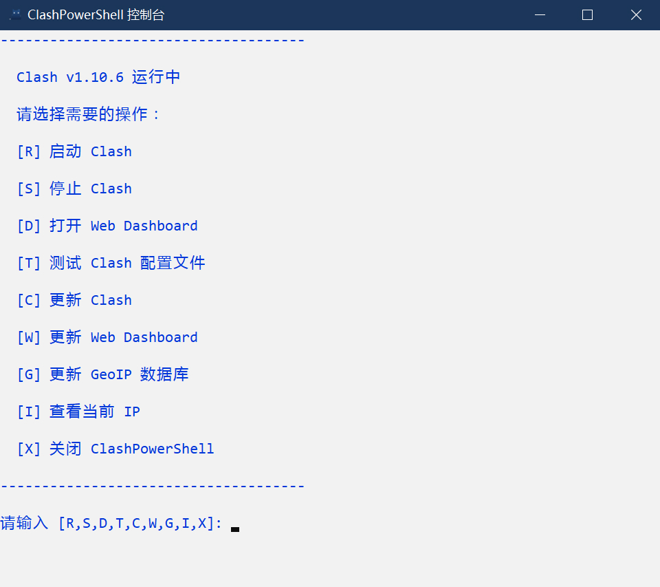

# ClashPowerShell

中文 | [English](README.md) 

## 功能特性

- 支持配置系统代理
- 支持自动下载
- 支持定时更新
- 支持 IP 查询
- 支持 GitHub 下载代理
- 支持测试 Clash 配置文件

## 配置文件

```json
{
    // Clash 控制器 URL
    "ClashControllerUrl": "http://127.0.0.1:9090",
    // Clash 更新检查周期，单位天。0: 禁用更新检查，7: 每 7 天更新检查一次
    "ClashCheckPeriod": 7,
    // Clash 最后一次更新检查时间戳
    "ClashLastCheck": -1,
    // Web Dashboard 类型，支持：razord 或 yacd
    "WebDashboardType": "razord",
    // Web Dashboard 更新检查周期，单位天。0: 禁用更新检查，7: 每 7 天更新检查一次
    "WebDashboardCheckPeriod": 7,
    // Web Dashboard 最后一次更新检查时间戳
    "WebDashboardLastCheck": -1,
    // GeoIP 数据库更新检查周期，单位天。0: 禁用更新检查，3: 每 3 天更新检查一次
    "GeoIPDbCheckPeriod": 3,
    // GeoIP 数据库最后一次更新检查时间戳
    "GeoIPDbLastCheck": -1,
    // GeoIP 数据库下载地址
    "GeoIPDbDownloadUrl": "https://cdn.jsdelivr.net/gh/Hackl0us/GeoIP2-CN@release/Country.mmdb",
    // 系统代理服务器地址
    "SysProxyServer": "127.0.0.1:7890",
    // 系统代理例外，使用分号(;)分隔各项
    "SysProxyBypass": "localhost;0.0.0.0;127.*;10.*;100.64.*;192.168.*;<local>",
    // IP 查询 URL
    "IPQueryUrl": "https://myip.ipip.net",
    // GitHub 下载代理 URL
    "GitHubProxyUrl": "https://ghproxy.com"
}
```

## 截图



## 开源协议

[GNU General Public License v3.0](LICENSE)
